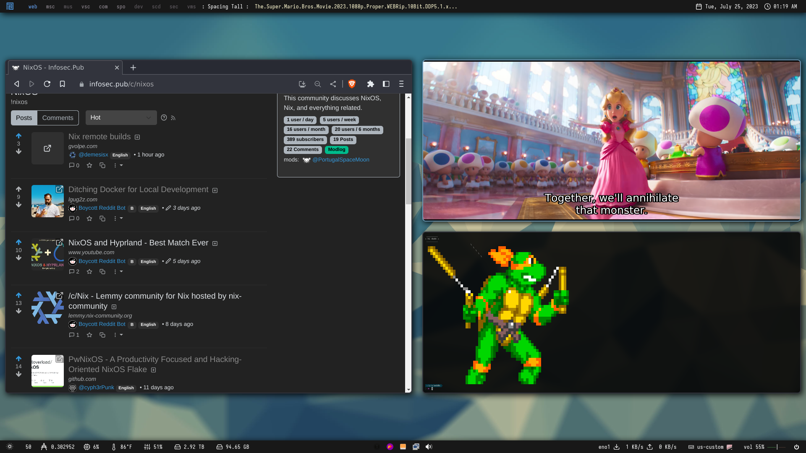
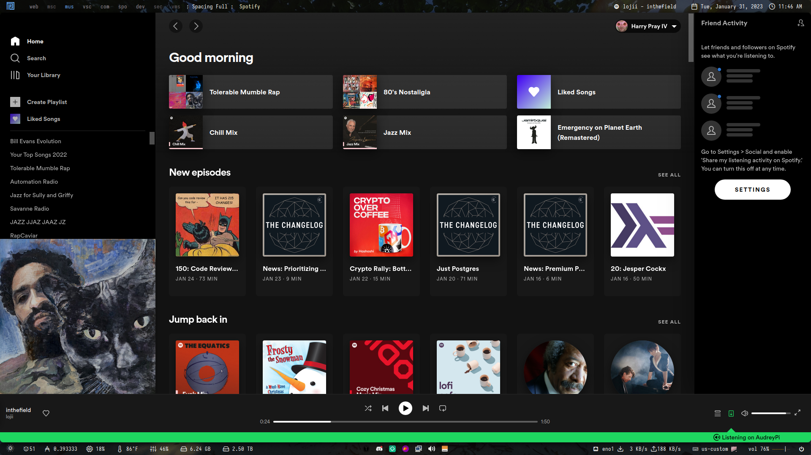

nix-config for my intelTower
==========

[](https://github.com/harryprayiv/nix-config/actions)
[](https://github.com/harryprayiv/nix-config/actions)

My current — and always evolving — NixOS configuration files, home-manager, neovim, etc.

## Web Workspace

## Open Source Software Workspace

## Music Workspace

## Developer Workspace

## Communications Workspace

## Stake Pool Workspace

## Security Workspace


## Programs

The `home.nix` file contains details about all the software I use, but here's a shout-out to the ones I use the most and that are customized to my needs.

| Type           | Program      |
| :------------- | :----------: |
| Editor #1      | [VsCodium](https://vscodium.com/) |
| Editor #2      | [NeoVim](https://neovim.io/) |
| Launcher       | [Rofi](https://github.com/davatorium/rofi) |
| Shell          | [Fish](https://fishshell.com/) |
| Status Bar     | [Polybar](https://polybar.github.io/) |
| Terminal       | [Alacritty](https://github.com/alacritty/alacritty) |
| Window Manager | [XMonad](https://xmonad.org/) |

## Themes

| Type           | Name      |
| :------------- | :----------: |
| GTK Theme      | [Juno Ocean](https://github.com/EliverLara/Juno) |
| GTK Icon Theme | [Beauty Line](https://www.gnome-look.org/p/1425426/) |
| Terminal Font  | [JetBrainsMono](https://www.jetbrains.com/lp/mono/) |

## Cardano Font


## Structure

Here is an overview of the folders' structure:

```
.
├── build
├── flake.nix
├── flake.lock
├── home
│  ├── config.nix
│  ├── home.nix
│  ├── modules
│  ├── overlays
│  ├── programs
│  ├── scripts
│  ├── secrets
│  ├── services
│  └── themes
├── imgs
├── outputs
│  ├── home-conf.nix
│  └── nixos-conf.nix
└── system
   ├── cachix
   ├── cachix.nix
   ├── configuration.nix
   ├── fonts
   ├── machine
   ├── misc
   └── wm
```

- `build`: the build and installation script.
- `flake.nix`: home and system configurations.
- `home`: all the user programs, services and dotfiles.
- `imgs`: screenshots and other images.
- `outputs`: the Home Manager and NixOS flake outputs.
- `system`: the NixOS configuration, settings for different laptops and window managers.

## Install

You can have a look at the available flake outputs before getting started.

```console
$ nix flake show github:harryprayiv/nix-config
git+file:///home/bismuth/nix-config
├───homeConfigurations: unknown
└───nixosConfigurations
    ├───intelNUC: NixOS configuration
    ├───intelTower: NixOS configuration
    └───plutusVM: NixOS configuration
```

As well as all the declared flake inputs.

```console
$ nix flake metadata github:harryprayiv/nix-config
Resolved URL:  github:harryprayiv/nix-config
Locked URL:    github:harryprayiv/nix-config/8c589a464114b6e6d8efd5e42804f2e8f2c5a9b6
Description:   Harry's Home Manager & NixOS configurations
Path:          /nix/store/ics3lfa1d1b2rkb9ywlrn7sga47j507j-source
Revision:      8c589a464114b6e6d8efd5e42804f2e8f2c5a9b6
Last modified: 2022-12-05 15:16:27
Inputs:
├───fish-bobthefish-theme: github:gvolpe/theme-bobthefish/e4418e8a7de9fbd6b5053a9b9009aa84a48398cd
├───fish-keytool-completions: github:ckipp01/keytool-fish-completions/dcb24bae7b8437e1e1210b00b7172841a26d6573
├───gh-md-toc: github:ekalinin/github-markdown-toc/435768259cb60e5842f7cde0679d495b3c31dfbd
├───home-manager: github:nix-community/home-manager/e4e639dd4dc3e431aa5b5f95325f9a66ac7e0dd9
│   ├───nixpkgs follows input 'nixpkgs'
│   └───utils: github:numtide/flake-utils/c0e246b9b83f637f4681389ecabcb2681b4f3af0
├───homeage: github:jordanisaacs/homeage/dd98c460175a0781ad0b51f4392de97c5454a5c4
│   └───nixpkgs follows input 'nixpkgs'
├───nixpkgs: github:NixOS/nixpkgs/fd54651f5ffb4a36e8463e0c327a78442b26cbe7
├───nurpkgs: github:nix-community/NUR/0092c612677e73dc8552d600727c7b076ca4a2da
└───tex2nix: github:harryprayiv/tex2nix/0634103134b4b7cb587c947e5588f8042f613a79
    ├───flake-utils: github:numtide/flake-utils/c0e246b9b83f637f4681389ecabcb2681b4f3af0
    └───nixpkgs follows input 'nixpkgs'
```

### NixOS

The full home configuration is not yet fully automated but the NixOS configuration can be installed by running the following command.

```console
$ nixos-rebuild switch --flake github:harryprayiv/nix-config#intelTower
```

Beware that the `hardware-configuration.nix` file is the result of the hardware scan of the specific machine and might not be suitable for yours.

### Home Manager

A fresh install requires the creation of certain directories so this has not been automated yet (see `build` script file). However, if you omit those steps, the entire HM configuration can also be built as any other flake.

```console
$ nix build github:harryprayiv/nix-config#homeConfigurations.bismuth-edp.activationPackage
$ result/activate
```

### Full configuration via script

On a fresh NixOS installation, run the following commands.

```console
$ nix flake clone github:harryprayiv/nix-config --dest /choose/a/path
$ nix run nixpkgs#git-crypt unlock
$ ./build fresh-install # requires sudo
```

> Note that `git-crypt unlock` requires your GPG Keys to be correctly set up.

The `build` script is only suitable for a fresh install customized to my personal use but you can build the flakes directly. E.g.

```console
$ nix build .#nixosConfigurations.intelTower.config.system.build.toplevel
sudo result/bin/switch-to-configuration switch
```

Or for Home Manager.

```console
$ nix build .#homeConfigurations.bismuth-edp.activationPackage
$ result/activate
```
