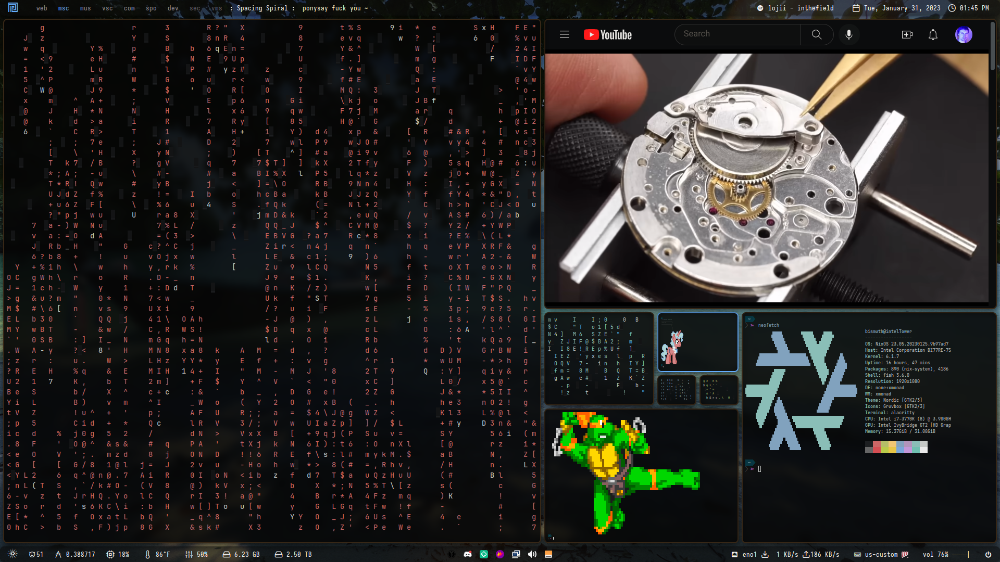
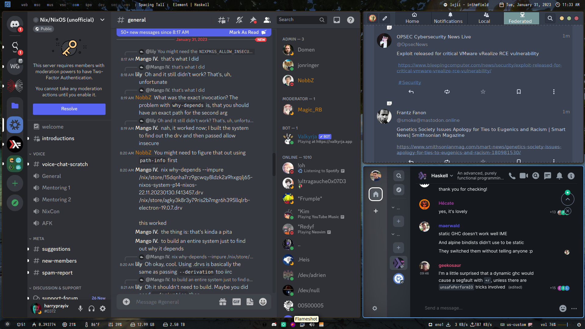

## Cardano 'nix-config' Repository 


[](https://github.com/cardanonix/nix-config/actions)
[](https://github.com/cardanonix/nix-config/actions)

==========

A repository of evolving NixOS Cardano SPO/dev environments with full configuration files, home-manager, neovim, etc. 

## Objectives: 

1. to make onboarding as smooth, effortless, and foolproof as possible. 

2. provide a single source of canonical, Nix-based Cardano configurations that are deterministic; this will be a source of truth for Nix/Cardano-related projects.

3. actively port each non-Nix-enabled Cardano-related component into this configuration

4. to make the Nix way more accessible to the Cardano developer community and encourage them to use flake-based development environments and modular, repeatable approaches.

## Programs

The `home.nix` file contains details about all the software I use, but here's a shout-out to the ones I use the most and that are customized to my needs.

| Type           | Program      |
| :------------- | :----------: |
| Editor #1      | [VsCodium](https://vscodium.com/) |
| Editor #2      | [NeoVim](https://neovim.io/) |
| Launcher       | [Rofi](https://github.com/davatorium/rofi) |
| Shell          | [Fish](https://fishshell.com/) |
| Status Bar     | [Polybar](https://polybar.github.io/) |
| Terminal       | [Alacritty](https://github.com/alacritty/alacritty) |
| Window Manager | [XMonad](https://xmonad.org/) |

## Themes

| Type           | Name      |
| :------------- | :----------: |
| GTK Theme      | [Juno Ocean](https://github.com/EliverLara/Juno) |
| GTK Icon Theme | [Beauty Line](https://www.gnome-look.org/p/1425426/) |
| Terminal Font  | [JetBrainsMono](https://www.jetbrains.com/lp/mono/) |

## Cardano Font
I am currently in the process of building [cardanofont: a font containing many of the logos in the Cardano ecosystem](https://github.com/cardanonix/cardanofont) and incorporating it into my config.


## Web Workspace

## Misc Workspace

## VsCodium Workspace

## Communications Workspace

## Stake Pool Workspace

## Dev Workspace

## Security Workspace

## Virtual Machine Workspace


## Structure


```
.
├── build
├── flake.nix
├── flake.lock
├── home
│  ├── config.nix
│  ├── home.nix
│  ├── modules
│  ├── overlays
│  ├── programs
│  ├── scripts
│  ├── secrets
│  ├── services
│  └── themes
├── slim
│  ├── config.nix
│  ├── home.nix
│  ├── modules
│  ├── overlays
│  ├── programs
│  ├── scripts
│  ├── secrets
│  ├── services
│  └── themes
├── imgs
└── system
   ├── cachix
   ├── cachix.nix
   ├── configuration.nix
   ├── fonts
   ├── machine
   ├── misc
   └── wm
```

- `build`: the build and installation script.
- `flake.nix`: home and system configurations.
- `home`: all the user programs, services and dotfiles.
- `slim`: bare bones user programs, services with dotfiles.
- `imgs`: screenshots and other images.
- `system`: the NixOS configuration, settings for different laptops and window managers.

## Install

You can have a look at the available flake outputs before getting started.

```console
$ nix flake show github:cardanonix/nix-config
github:cardanonix/nix-config/
├───homeConfigurations: unknown
    ├───bismuth: Home Manager configuration
    └───slim: Lightweight Home Manager configuration
└───nixosConfigurations
    ├───intelNUC: NixOS configuration
    ├───intelTower: NixOS configuration
    └───plutusVM: NixOS configuration
```

As well as all the declared flake inputs.

```console
$ nix flake metadata github:cardanonix/nix-config
Resolved URL:  github:cardanonix/nix-config
Locked URL:    github:cardanonix/nix-config/a05a12570772dc5295143f1eda9bad7014bbd581
Description:   cardanonix's Home Manager & NixOS configurations
Path:          /nix/store/bj3rp240rldzcbhm6yc0q1vmxckzspb7-source
Revision:      a05a12570772dc5295143f1eda9bad7014bbd581
Last modified: 2023-02-24 12:18:39
Inputs:

├───CHaP: github:input-output-hk/cardano-haskell-packages/49edea9f38a113d7137d095111e4e6523c5bdeed
├───cardano-node: github:input-output-hk/cardano-node/8762a10efe3f9f97939e3cb05edaf04250456702
├───cncli: github:cardano-community/cncli/a92c643b165687cbdfb16de6e76fc5ae4b38bd5c
├───deploy: github:input-output-hk/deploy-rs/4da8eb9fc3e611adf4bbe8c8df5b1fc604c4f906
├───fish-bobthefish-theme: github:cardanonix/theme-bobthefish/e4418e8a7de9fbd6b5053a9b9009aa84a48398cd
├───fish-keytool-completions: github:ckipp01/keytool-fish-completions/dcb24bae7b8437e1e1210b00b7172841a26d6573
├───flake-utils: github:numtide/flake-utils/3db36a8b464d0c4532ba1c7dda728f4576d6d073
├───gh-md-toc: github:ekalinin/github-markdown-toc/661b5c5111f47174e2d9092c8d76867e5a1f249d
├───haskellNix: github:input-output-hk/haskell.nix/14f740c7c8f535581c30b1697018e389680e24cb
├───home-manager: github:nix-community/home-manager/4295fdfa6b0005c32f2e1f0b732faf5810c1bc7f
├───iohkNix: github:input-output-hk/iohk-nix/82e833b60c47bf0f352443879af1766712e9ca6f
├───neovim-flake: github:Cardano-on-Nix/neovim-flake/b1db271c1effc8fe12ec5f8003a70d1a0b5a9824
├───nix: github:NixOS/nix/435a16b5556f4171b4204a3f65c9dedf215f168c
├───nixos-hardware: github:NixOS/nixos-hardware/2d44015779cced4eec9df5b8dab238b9f6312cb2
├───nixpkgs: github:NixOS/nixpkgs/988cc958c57ce4350ec248d2d53087777f9e1949
├───nixpkgs-nautilus-gtk3: github:NixOS/nixpkgs/37bd39839acf99c5b738319f42478296f827f274
├───nurpkgs: github:nix-community/NUR/9bde3171aeb5954b7955fcb09b231f53caf76b54
├───rust-nix: github:input-output-hk/rust.nix/2fd5fce3ec67e6915cb79cbf132f023e147b31ba
├───sops-nix: github:Mic92/sops-nix/2c5828439d718a6cddd9a511997d9ac7626a4aff
├───statix: github:nerdypepper/statix/3c7136a23f444db252a556928c1489869ca3ab4e
└───unison-nix: github:ceedubs/unison-nix/cf10749d64b84307f42b2ba3f8f27aaa2a34fd50
```

### NixOS

The full home configuration is not yet fully automated but the NixOS configuration can be installed by running the following command.

```console
$ nixos-rebuild switch --flake github:cardanonix/nix-config#intelTower
```

Beware that the `hardware-configuration.nix` file is the result of the hardware scan of the specific machine and might not be suitable for yours.

### Home Manager

A fresh install requires the creation of certain directories so this has not been automated yet (see `build` script file). However, if you omit those steps, the entire HM configuration can also be built as any other flake.

```console
$ nix build github:cardanonix/nix-config#homeConfigurations.bismuth-edp.activationPackage
$ result/activate
```

### Full configuration via script

On a fresh NixOS installation, run the following commands.

```console
$ nix flake clone github:cardanonix/nix-config --dest /choose/a/path
$ nix run nixpkgs#git-crypt unlock
$ ./build fresh-install # requires sudo
```

> Note that `git-crypt unlock` requires your GPG Keys to be correctly set up.

The `build` script is only suitable for a fresh install customized to my personal use but you can build the flakes directly. E.g.

```console
$ nix build .#nixosConfigurations.intelTower.config.system.build.toplevel
sudo result/bin/switch-to-configuration switch
```

Or for Home Manager.

```console
$ nix build .#homeConfigurations.bismuth-edp.activationPackage
$ result/activate
```